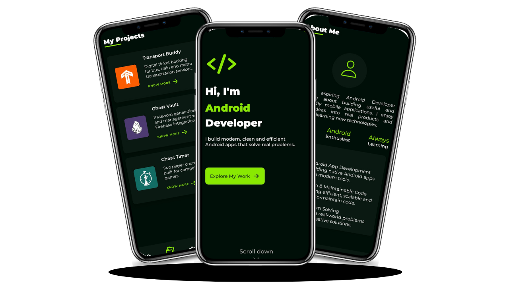
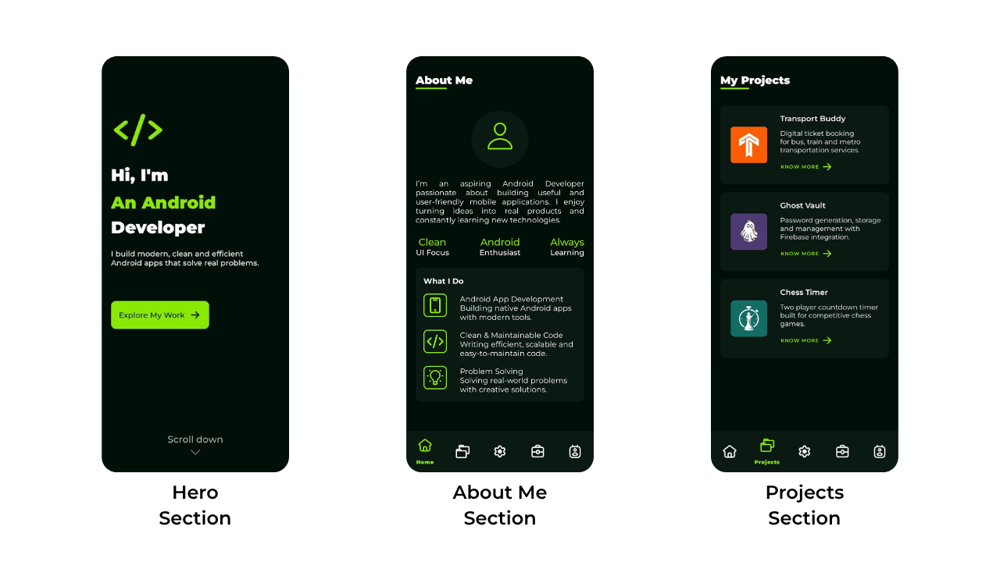
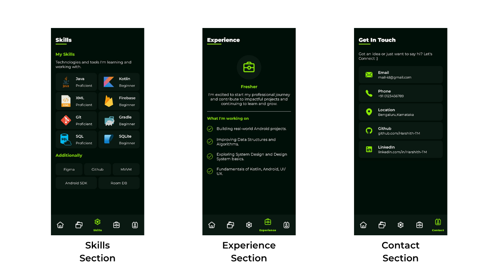

# 📱 Portfolio App

## 🎨 MockUp

## 📖 Overview
A modern Android Portfolio application built using **Java** and **XML**. This project was created as a practice application to improve Android UI/UX development skills and gain hands-on experience with designing responsive mobile interfaces.

---

## 🚀 Features

The app consists of the following sections:

- 🦸 Hero Section
- 🙋 About Section
- 💼 Projects Section
- 🛠️ Skills Section
- 📈 Experience Section
- 📬 Contact Section

---

## 🧑‍💻 Tech Stack

- Java
- Android XML
- Android SDK
- Constraint Layout
- Recycler View
- Bottom Navigation View

---

## 📖 What I Learned

While building this project, I gained practical experience with:

- Constraint Layout Fundamentals
- Layout Guidelines for responsive UI Design
- View Animations
- Card view
- Android Styles and Themes
- Multi-View RecyclerView
- Android Intents
- Lottie Animations
- UI Component Reusability

---

## 📷 Screenshots

### Screenshot 1

### Screenshot 2

---

  

---
